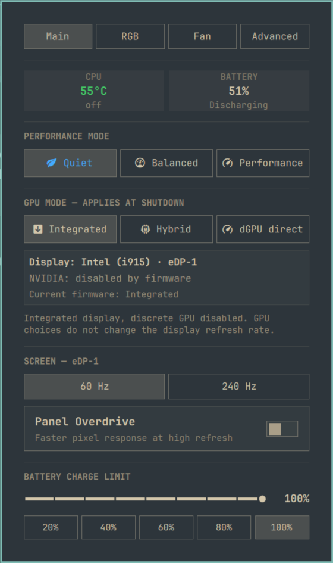
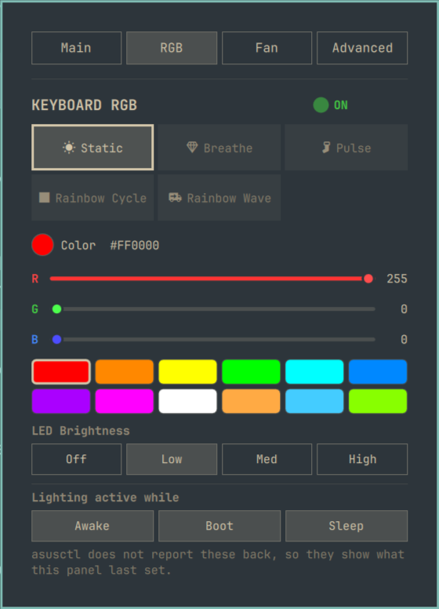
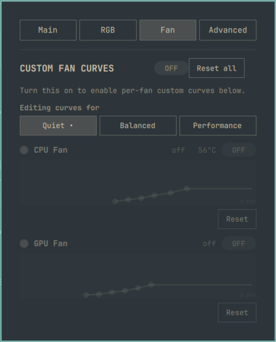
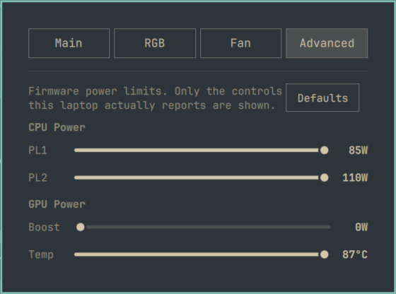

# g-helparchy

ASUS laptop controls for the [Omarchy](https://omarchy.org) bar, built on
[asusctl](https://asus-linux.org/).

| Main | RGB |
|---|---|
|  |  |

| Fan | Advanced |
|---|---|
|  |  |

## Standard features

- Quiet, Balanced, and Performance profiles
- GPU mode selection
- Screen refresh rate and panel overdrive
- Keyboard RGB effects and brightness
- Custom fan curves for each power profile
- Battery charge limits
- CPU and GPU power limits
- Temperatures, fan speeds, and battery readings

Available controls depend on your laptop and what asusctl supports.

## Enhanced in this fork

- Corrected Integrated, Hybrid, and dGPU direct mode switching
- Separate displays for the current GPU mode and changes queued for shutdown
- A view of which GPU drives the screen, NVIDIA's power state, and apps using it
- Confirmation before disabling a busy GPU, plus an option to replace a queued change
- GPU monitoring without polling nvidia-smi and waking a sleeping GPU
- Reliable power-limit defaults and support for more battery device names

GPU changes take effect after a normal shutdown or reboot. Available GPU
readings depend on the driver.

## Install

Requires Omarchy Quattro and a working asusctl/asusd setup. Disable any other
ASUS control widget before enabling this one.

```bash
omarchy plugin add https://github.com/a-barwick/g-helparchy.git --enable
```

The plugin uses Hyprland's `hyprctl` and systemd's `busctl`. Optional tools:
`fuser` (`psmisc`) for the GPU process list, and `hyprmoncfg` for saving screen
refresh changes to a monitor profile.

## Remove

```bash
omarchy plugin remove io.github.a-barwick.g-helparchy
```

Removing the plugin leaves your firmware settings as they are.

## Development

```bash
node test-model.js
node test-panel.js
omarchy plugin validate .
```

## Credits and license

Based on [moneytosms' original ASUS panel](https://github.com/moneytosms/omarchy-asus).
Thanks for building and sharing it. [MIT license](LICENSE).
